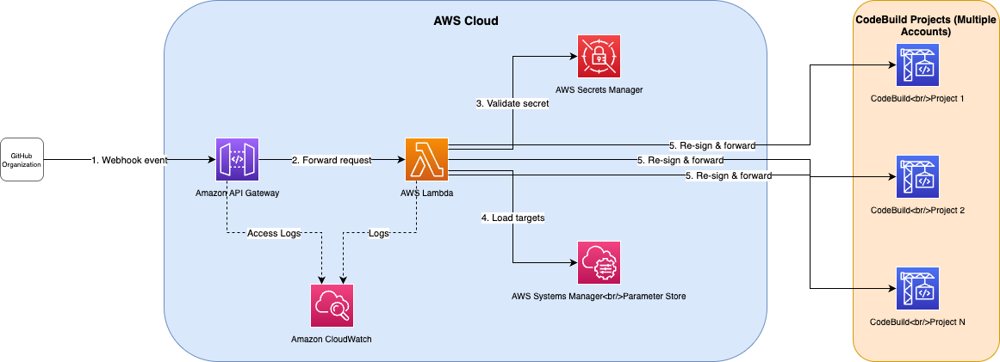

# Guidance for GitHub Webhook Proxy for AWS CodeBuild on AWS

This Guidance demonstrates how to deploy a webhook proxy that fans out a single GitHub organization webhook to multiple AWS CodeBuild projects across multiple accounts, solving the GitHub 20-webhook-per-organization limit.

## Table of Contents

1. [Overview](#overview)
    - [Architecture](#architecture)
    - [Cost](#cost)
2. [Prerequisites](#prerequisites)
    - [Operating System](#operating-system)
    - [AWS CDK Bootstrapping](#aws-cdk-bootstrapping)
3. [Deployment Steps](#deployment-steps)
4. [Deployment Validation](#deployment-validation)
5. [Running the Guidance](#running-the-guidance)
6. [Next Steps](#next-steps)
7. [Cleanup](#cleanup)
8. [Notices](#notices)

## Overview

Organizations using GitHub with many AWS CodeBuild projects often hit the GitHub limit of 20 webhooks per organization. This Guidance deploys a lightweight proxy that receives a single GitHub organization webhook and fans it out to any number of CodeBuild project webhook endpoints across multiple AWS accounts and Regions.

The proxy validates the incoming GitHub HMAC-SHA256 signature, re-signs the payload with each CodeBuild project's individual webhook secret, and forwards the event. This approach reduces webhook management overhead from N webhooks to 1.

### Architecture



*Figure 1: Guidance for GitHub Webhook Proxy for AWS CodeBuild on AWS architecture diagram*

1. GitHub sends a webhook event (e.g., push, pull request) to the Amazon API Gateway HTTPS endpoint.
2. Amazon API Gateway forwards the request to an AWS Lambda function.
3. The Lambda function retrieves the GitHub webhook secret from AWS Secrets Manager and validates the `X-Hub-Signature-256` header.
4. The Lambda function retrieves the list of registered CodeBuild targets and their individual secrets from AWS Systems Manager Parameter Store.
5. For each registered target, the Lambda function re-signs the payload using the target's CodeBuild webhook secret and forwards the event to the target's webhook URL.
6. The Lambda function returns a summary of successes and failures.

### Cost

You are responsible for the cost of the AWS services used while running this Guidance. As of April 2026, the cost for running this Guidance with the default settings in the US East (N. Virginia) AWS Region is approximately **$5 per month** based on the following assumptions:

- ~1,000 webhook events per day across 60 CodeBuild projects

| AWS Service | Dimensions | Monthly Cost (USD) |
|---|---|---|
| Amazon API Gateway | 30,000 REST API calls/month | $3.50 |
| AWS Lambda | 30,000 invocations, 256 MB, ~500ms avg | $0.50 |
| AWS Secrets Manager | 1 secret, ~30,000 API calls/month | $0.40 |
| AWS Systems Manager Parameter Store | Standard tier parameters | $0.00 |
| **Total** | | **~$4.40** |

## Prerequisites

### Operating System

This Guidance is compatible with Mac, Linux, and Windows operating systems.

### AWS CDK Bootstrapping

This Guidance uses AWS CDK. If you have not used CDK in the target account and Region, you must bootstrap it first:

```bash
cdk bootstrap aws://ACCOUNT-NUMBER/REGION
```

### Software Requirements

- [Node.js](https://nodejs.org/) 18.x or later
- [AWS CDK](https://docs.aws.amazon.com/cdk/v2/guide/getting-started.html) v2 (`npm install -g aws-cdk`)
- AWS CLI configured with credentials for the deployment account
- CodeBuild projects created with `manualCreation: true` in their webhook configuration

### (Optional) Run Security Scan on the CDK Application

You can use [cdk-nag](https://github.com/cdklabs/cdk-nag) to verify the infrastructure follows AWS best practices. cdk-nag with the AwsSolutions rule pack is already integrated into this Guidance and runs automatically during `cdk synth`.

## Deployment Steps

### 1. Clone the repository

```bash
git clone https://github.com/aws-solutions-library-samples/guidance-for-github-webhook-proxy-for-aws-codebuild-on-aws.git
cd guidance-for-github-webhook-proxy-for-aws-codebuild-on-aws
```

### 2. Install dependencies

```bash
npm install
```

### 3. Register CodeBuild targets

For each CodeBuild project, you need the `payloadUrl` and `secret` that CodeBuild generated when the project was created with `manualCreation: true`.

Edit `config/targets.json`:

```json
{
  "targets": [
    {
      "name": "account1-project-alpha",
      "payloadUrl": "https://codebuild.us-east-1.amazonaws.com/webhooks/...",
      "secret": "the-codebuild-webhook-secret"
    },
    {
      "name": "account2-project-beta",
      "payloadUrl": "https://codebuild.ap-southeast-2.amazonaws.com/webhooks/...",
      "secret": "another-codebuild-webhook-secret"
    }
  ]
}
```

> **⚠️ Security Note:** `config/targets.json` contains sensitive webhook secrets. Do **not** commit real secrets to source control. For production use, consider:
> - Using environment-specific config files excluded via `.gitignore`
> - Injecting secrets at deploy time from a secrets manager or CI/CD pipeline variables
> - Using CDK context variables or a `.env` file (already in `.gitignore`)

### 4. Set your GitHub webhook secret

Choose a strong secret that you will also configure in GitHub:

```bash
export GITHUB_WEBHOOK_SECRET="your-chosen-secret"
```

### 5. Deploy

```bash
npx cdk deploy --context githubWebhookSecret=$GITHUB_WEBHOOK_SECRET
```

The deployment outputs the API Gateway webhook URL.

### 6. Configure GitHub

1. Go to your GitHub Organization → **Settings** → **Webhooks** → **Add webhook**
2. Set **Payload URL** to the API Gateway endpoint from the deployment output
3. Set **Content type** to `application/json`
4. Set **Secret** to the same `GITHUB_WEBHOOK_SECRET` you used above
5. Select events: **Workflow jobs** (and any other events your CodeBuild projects need)

## Deployment Validation

1. Open the [AWS CloudFormation console](https://console.aws.amazon.com/cloudformation/) and verify the stack `GitHubWebhookProxyStack` shows `CREATE_COMPLETE`.
2. Open the [Amazon API Gateway console](https://console.aws.amazon.com/apigateway/) and verify the `GitHub Webhook Proxy` API exists with a `prod` stage.
3. Open the [AWS Lambda console](https://console.aws.amazon.com/lambda/) and verify the `GitHubWebhookProxy` function exists.

You can also verify from the CLI:

```bash
aws cloudformation describe-stacks --stack-name GitHubWebhookProxyStack --query "Stacks[0].StackStatus"
```

Expected output: `"CREATE_COMPLETE"`

## Running the Guidance

Once deployed and configured in GitHub:

1. GitHub sends a **ping** event to verify the webhook. Check CloudWatch Logs at `/aws/lambda/GitHubWebhookProxy` for a `pong` response.
2. Trigger a real event (e.g., push a commit) and verify in CloudWatch Logs that the event was forwarded to all registered targets.
3. Check your CodeBuild projects to confirm builds are triggered.

### Managing Targets

**Adding a new CodeBuild project:**
1. Add the new target to `config/targets.json`
2. Run `npx cdk deploy --context githubWebhookSecret=$GITHUB_WEBHOOK_SECRET`

**Removing a CodeBuild project:**
1. Remove it from `config/targets.json`
2. Run `npx cdk deploy --context githubWebhookSecret=$GITHUB_WEBHOOK_SECRET`

### Monitoring

- Lambda execution logs: CloudWatch Logs at `/aws/lambda/GitHubWebhookProxy`
- API Gateway access logs: CloudWatch Logs (log group created by the stack)
- Failed forwarding attempts are logged with the target name and HTTP status code

## Next Steps

- Add [AWS WAF](https://aws.amazon.com/waf/) in front of the API Gateway for additional protection against unwanted traffic.
- Implement [Amazon CloudWatch Alarms](https://docs.aws.amazon.com/AmazonCloudWatch/latest/monitoring/AlarmThatSendsEmail.html) on Lambda error metrics for proactive alerting.
- Consider using [AWS Lambda Powertools](https://docs.powertools.aws.dev/lambda/typescript/latest/) for structured logging and tracing.

## Cleanup

To remove all resources created by this Guidance:

```bash
npx cdk destroy
```

This deletes the CloudFormation stack and all associated resources (API Gateway, Lambda function, Secrets Manager secret, SSM parameters, and CloudWatch log groups).

## Notices

*Customers are responsible for making their own independent assessment of the information in this Guidance. This Guidance: (a) is for informational purposes only, (b) represents AWS current product offerings and practices, which are subject to change without notice, and (c) does not create any commitments or assurances from AWS and its affiliates, suppliers or licensors. AWS products or services are provided "as is" without warranties, representations, or conditions of any kind, whether express or implied. AWS responsibilities and liabilities to its customers are controlled by AWS agreements, and this Guidance is not part of, nor does it modify, any agreement between AWS and its customers.*
